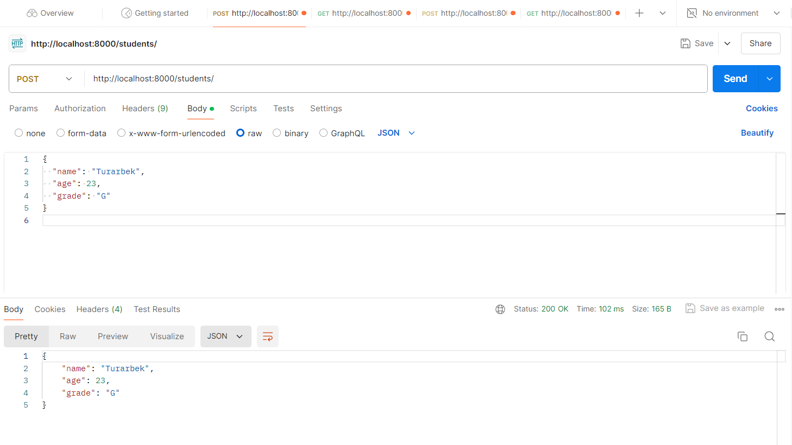

# Тестовое задание Junior Backend 

## Запуск проекта

1. Клонируйте репозиторий и перейдите в директорию проекта:
    ```bash
    git clone <URL>
    cd Test_Junior_Backend
    ```

2. Создайте и активируйте виртуальное окружение:
    ```bash
    python -m venv venv
    source venv/bin/activate  # Linux/MacOS
    # venv\Scripts\activate  # Windows
    ```

3. Установите зависимости:
    ```bash
    pip install -r requirements.txt
    ```

4. Запустите сервер:
    ```bash
    uvicorn main:app --reload
    ```

## Эндпоинты API

### Students
- **POST /students/**: Создать нового ученика.
- **GET /students/{student_id}**: Получить информацию о конкретном ученике.
- **PATCH /students/{student_id}**: Обновить информацию о конкретном ученике.
- **DELETE /students/{student_id}**: Удалить ученика.

### Scores
- **POST /scores/**: Добавить оценку ученику.
- **GET /scores/{score_id}**: Получить информацию о конкретной оценке.
- **PATCH /scores/{score_id}**: Обновить информацию о конкретной оценке.
- **DELETE /scores/{score_id}**: Удалить оценку.

## Пример POST запроса к students через Postman
